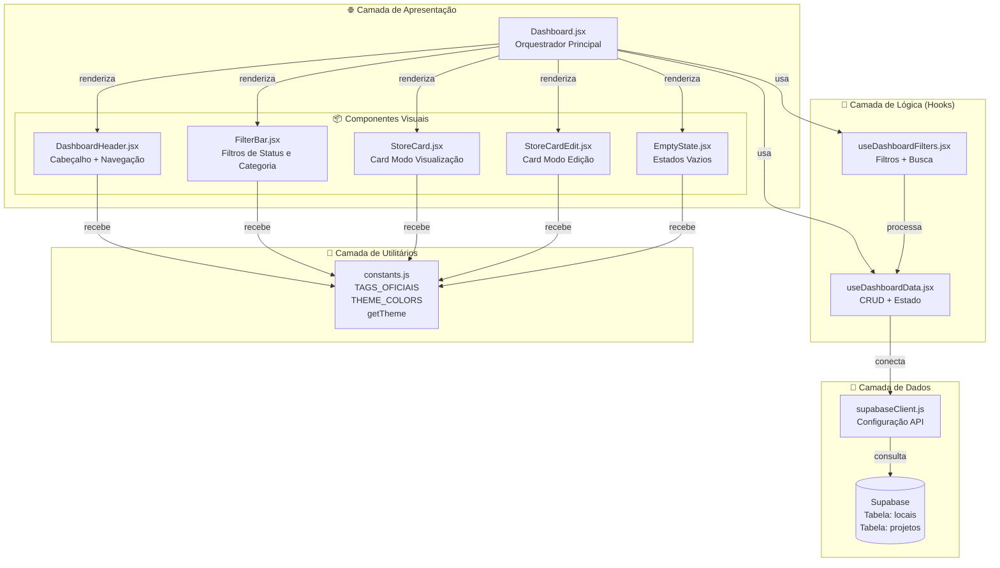
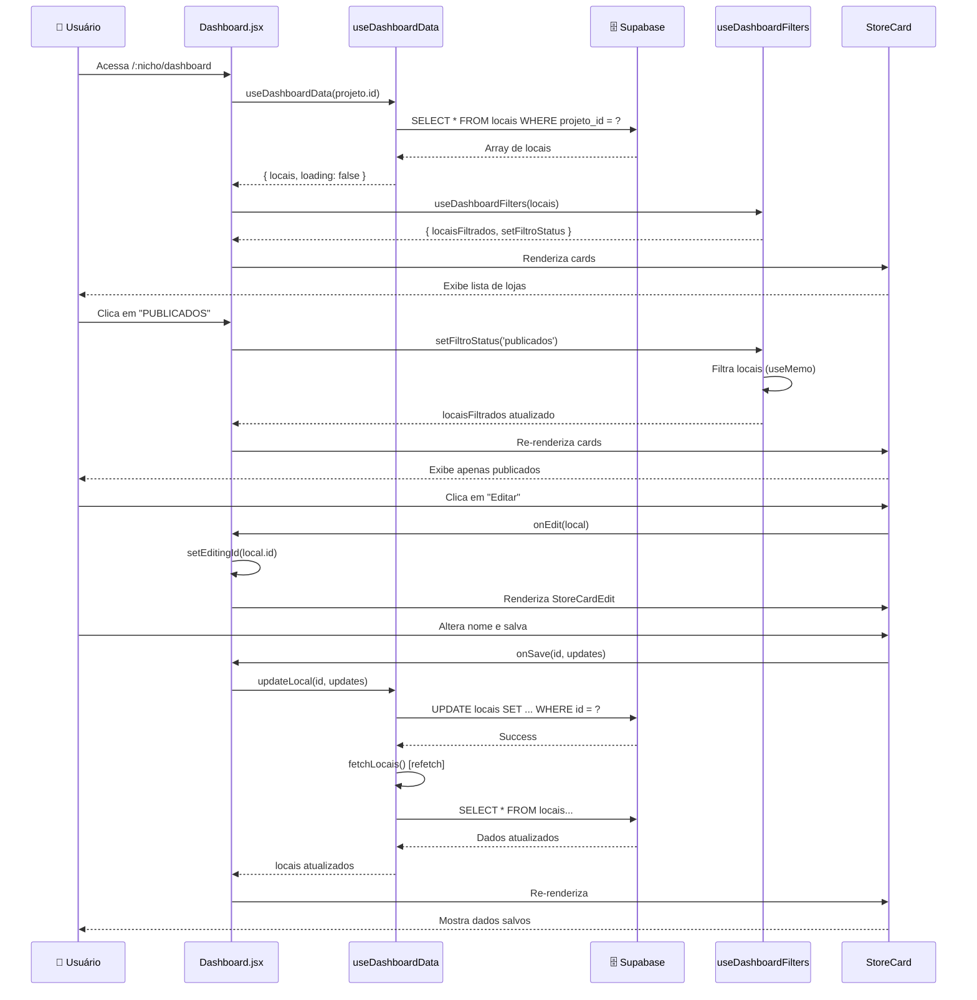
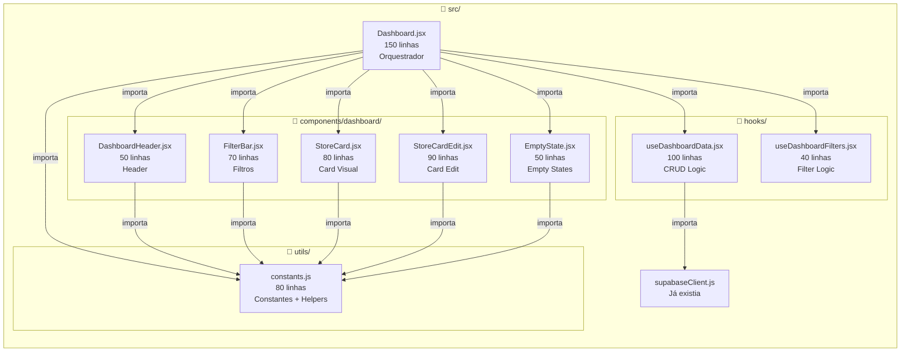

# 🐶 Local Finder - Documentação de Negócio & Técnica
**Versão:** MVP 1.0 (Concierge Lead Gen)
**Status:** Pronto para Deploy (Vercel)

## 1. Visão Geral do Produto
O Local Finder é um **Web App de Curadoria (Concierge)** focado em conectar donos de pets a serviços locais de alta qualidade (Pet Shops, Veterinários, Banho e Tosa).
Diferente do Google Maps (que é poluído e genérico), o Local Finder oferece uma lista "limpa", tags claras e um atendimento pré-venda simulado que qualifica o lead antes de enviar para o WhatsApp do lojista.

## 2. Regras de Negócio (Core Rules)
1.  **Modelo Concierge:** O usuário não fala direto com a loja. Ele passa por um "Chat Fake" do App primeiro.
2.  **Pedágio de Lead (Tollgate):** O link do WhatsApp da loja **nunca** é exibido abertamente. O usuário é obrigado a informar **Nome** e **Telefone** no chat para liberar o redirecionamento.
3.  **Curadoria Manual:** Lojas não se cadastram sozinhas (por enquanto). Nós (Admin) inserimos as lojas para garantir qualidade e padronização.
4.  **Mensagem Contextualizada:** O lead chega no WhatsApp do lojista com uma mensagem pronta: *"Olá, me chamo [Nome], vim pelo LocalFinder e quero saber sobre [Assunto]"*.

## 3. Arquitetura Técnica
* **Front-end:** React (Vite) + Lucide React (Ícones).
* **Back-end/Banco:** Supabase (PostgreSQL + RLS Policies).
* **Hospedagem:** Vercel (Front) + Supabase Cloud (Dados).
* **Segurança:** RLS configurado para permitir leitura pública (`locais`) e escrita anônima (`leads`).

## 4. Fluxos Principais
### A. Fluxo de Ingestão de Dados (O "Segredo")
1.  Admin copia dados brutos da lista lateral do Google Maps.
2.  Cola na rota `/admin` do App.
3.  Sistema gera um Prompt de Engenharia de Dados.
4.  Admin joga na IA -> IA devolve SQL limpo.
5.  Admin roda SQL no Supabase.

### B. Fluxo do Usuário Final
1.  Acessa Home (`/`) -> Vê lista filtrada (`status = PUBLICAR_APP`).
2.  Clica em "Falar com Atendente".
3.  Interage com Chat Bot (Simulação de delay e atendimento).
4.  Bot pede Nome/Zap -> Usuário preenche.
5.  **App Salva Lead no Supabase** -> Redireciona para WhatsApp Web/App.

### C. Fluxo Administrativo (Dashboard)
1.  Acessa `/dashboard`.
2.  **Aba Lojas:** Vê todas as lojas. Pode ocultar (Rascunho) ou Publicar com 1 clique.
3.  **Aba Leads:** Vê tabela de quem entrou em contato, telefone e interesse.

## 5. Histórico de Decisões (Log de Ideias)
* ✅ **Ideia Aprovada:** "Gerador de Prompt Local". Em vez de criar um scraper complexo em Python/Selenium (que quebrava muito), criamos um formatador de texto simples que usa a inteligência da IA (ChatGPT) para limpar os dados. Eficiência 10x maior.
* ✅ **Ideia Aprovada:** Dashboard Simples. Controle de visibilidade via booleano no banco, sem precisar de painel admin complexo com login no início.
* ❌ **Ideia Descartada:** Scraper Automático via Extensão. Testamos, mas os seletores CSS do Google Maps mudam dinamicamente e traziam dados sujos. O custo de manutenção não valia a pena para o MVP.
* ❌ **Ideia Descartada:** Captura manual detalhada (clicar loja por loja). Muito lento (2 min/loja). O método de "Copiar Lista" + IA resolveu com 90% da qualidade em 10% do tempo.

## 6. Próximos Passos (Roadmap)
1.  **Geolocalização:** Ordenar lista por "Mais perto de mim".
2.  **Monetização:** Cobrar do lojista para ter destaque ("Super Partner").
3.  **Login de Lojista:** Permitir que o dono da loja veja seus próprios leads (SaaS B2B).


Atualização

# 🐶 Local Finder - Documentação de Negócio & Técnica
**Versão:** MVP 1.5 (Recurso Premium & Dashboard 2.0)
**Status:** Pré-Fábrica (Preparando para Multi-Nicho)

## 1. Visão Geral do Produto
O Local Finder é uma **Plataforma de Curadoria Premium** que conecta clientes a serviços locais. Diferente de listas comuns, oferecemos uma experiência hierárquica onde parceiros "VIP" ganham destaque visual, vídeos embarcados e prova social (notas), aumentando a conversão.

## 2. Regras de Negócio (Core Rules)
1.  **Hierarquia Visual:**
    * **VIP (Destaque):** Card expandido, borda dourada, selo "Recomendado", exibe vídeo do Instagram (Reels) e Nota/Avaliações.
    * **Padrão:** Card simples com nome, endereço e botão de contato.
2.  **Pedágio de Lead (Tollgate):** O link do WhatsApp da loja permanece oculto até o usuário preencher o formulário no Chat Fake.
3.  **Gestão Facilitada:** O Admin não precisa de SQL. O Dashboard permite promover lojas a VIP, editar notas e colar links de mídia visualmente.
4.  **Ingestão IA:** O sistema de cadastro usa IA para ler dados sujos do Google Maps e extrair automaticamente notas e nº de avaliações.

## 3. Arquitetura Técnica
* **Front-end:** React (Vite) + Lucide Icons + `react-social-media-embed`.
* **Estilização:** CSS Inline com **Variáveis CSS** (`var(--cor-primaria)`) preparando para white-label.
* **Back-end/Banco:** Supabase (PostgreSQL).
* **Segurança:** RLS Policies ativas (Leitura pública, Escrita anônima em leads, Edição restrita).

## 4. Estrutura de Dados (Atualizada)
### Tabela `locais`
* `id` (uuid), `nome` (text), `telefone` (text), `endereco` (text)
* `tags` (array), `status` (text: 'RASCUNHO' | 'PUBLICAR_APP')
* `is_whatsapp` (bool)
* **[NOVO]** `nota` (numeric - ex: 4.8)
* **[NOVO]** `avaliacoes` (int - ex: 150)
* **[NOVO]** `instagram_url` (text - Link do Post/Reel)
* **[NOVO]** `destaque` (boolean - Define se é VIP)

### Tabela `leads`
* `id`, `nome`, `telefone`, `loja_alvo`, `mensagem_inicial`, `created_at`.

## 5. Histórico de Evolução
* ✅ **MVP 1.0:** Listagem simples e captura de leads.
* ✅ **MVP 1.5 (Atual):** Implementação de Destaques (VIP), integração com Instagram e Dashboard com edição ativa (CRUD).
* 🔜 **Próximo:** Transformação em "Fábrica de Apps" (Multi-Nicho/Multi-Tenancy).

## 6. Fluxos Principais
### A. Fluxo de Edição VIP (Dashboard)
1.  Admin acessa `/dashboard`.
2.  Clica no ícone de **Lápis** no card da loja.
3.  Insere Nota, Avaliações, Link do Instagram e marca "Destaque".
4.  Salva -> O App final atualiza instantaneamente com o layout Premium.


# 🏭 Fábrica de Apps (Local Finder Engine) - Documentação v2.0
**Status:** Em Produção (Vercel) | **Arquitetura:** Multi-Tenant (Multi-Nicho)

## 1. Visão Geral
O projeto evoluiu de um site único para uma **Fábrica de Plataformas de Curadoria**. O mesmo código-fonte agora gera múltiplos aplicativos (ex: `/pets`, `/mecanicos`, `/barber`), diferenciados por configurações no Banco de Dados (Cores, Títulos, Dados).
A monetização foca no modelo "Premium": estabelecimentos pagam para ter **Destaque Visual** e **Mídia Embarcada** (Instagram).

## 2. Regras de Negócio & Funcionalidades
1.  **Multi-Tenancy (Fábrica):**
    * A rota `/` exibe os nichos disponíveis.
    * A rota `/:nicho` (ex: `/pets`) carrega o App com a identidade visual e dados daquele nicho específico.
2.  **Hierarquia Premium:**
    * **VIP:** Borda colorida, Selo, Nota/Avaliações e Embed de Instagram.
    * **Standard:** Card simples.
3.  **Gestão (Dashboard):**
    * Cada nicho tem seu painel: `/:nicho/dashboard`.
    * Permite edição "No-Code": Alterar notas, promover a Destaque e colar links do Instagram.
    * **Isolamento:** O Gestor de Pets não vê leads de Mecânicos.
4.  **Ingestão IA:** O `AdminGenerator` cria prompts SQL customizados por nicho para popular o banco rapidamente via ChatGPT/Gemini.

## 3. Stack Tecnológico
* **Front:** React (Vite), React Router Dom (Roteamento Dinâmico).
* **Back/DB:** Supabase (PostgreSQL).
* **Deploy:** Vercel (Integração Contínua com GitHub).
* **Bibliotecas Chave:** `lucide-react` (ícones), `react-social-media-embed` (Instagram).

## 4. Estrutura de Banco de Dados (Supabase)
* **`projetos` (A Mãe):** `id`, `slug` (url), `cor_primaria`, `cor_destaque`, `nome`.
* **`locais` (Os Filhos):** `id`, `nome`, `nota`, `avaliacoes`, `instagram_url`, `destaque`, `projeto_id` (FK).
* **`leads` (O Ouro):** `id`, `nome`, `telefone`, `projeto_id` (FK).

## 5. Fluxo de Trabalho (Deploy)
* **Conteúdo (Dados):** Edita-se direto no Dashboard em Produção.
* **Código (Estrutura):** Edita no Localhost -> Commit no Git -> Vercel atualiza automático.


# 🐶 Local Finder - Documentação v2.1 (Visual Update)

## 1. Mudanças Visuais (UX)
* **Navegação:** Substituímos filtros de texto por **4 Botões de Categoria** com ícones (Estilo iFood).
* **Tags Visuais:** No card, as tags aparecem como etiquetas padronizadas.

## 2. Regras de Dados (Taxonomia)
O sistema agora é rígido. Não usamos mais texto livre para tags.
As únicas tags permitidas pelo sistema (para os botões funcionarem) são:
1. `banho` (Estética, Banho e Tosa)
2. `vet` (Clínicas, Hospitais, Vacinas)
3. `loja` (Pet Shops, Rações, Acessórios)
4. `hotel` (Creche, Hospedagem)

## 3. Fluxo de Cadastro (Atualizado)
1. **Ingestão IA:** O prompt agora converte automaticamente termos como "Clínica" para `vet`.
2. **Dashboard:** O campo de tags agora usa **Checkboxes** para evitar erros de digitação.
3. **Geolocalização:** O Banco está preparado para receber Latitude/Longitude (via URL do Maps) para futuro recurso de "Perto de Mim".


# 🛠️ Manual Técnico: SaaS Engine v5.0
**Projeto:** Pet Finder Factory
**Arquitetura:** React + Vite + Supabase
**Hospedagem:** Vercel

---

## 1. Arquitetura de Dados (Supabase)

O sistema baseia-se em uma estrutura relacional de duas tabelas principais. Para o funcionamento correto das versões v4.0+, as colunas abaixo devem existir:

### Tabela `projetos`
* `id`: uuid (Primary Key)
* `nome`: text
* `slug`: text (Unique - ex: 'minha-franquia')
* `cor_primaria`: text (Hexadecimal)
* `cor_destaque`: text (Hexadecimal)
* `tema_base`: text ('light' ou 'dark')
* `logo_url`: text (URL pública)

### Tabela `locais`
* `id`: uuid (Primary Key)
* `projeto_id`: uuid (Foreign Key -> projetos.id)
* `nome`: text
* `status`: text ('PUBLICAR_APP' ou 'RASCUNHO')
* `tags`: _text (Array de strings: ['banho', 'vet', etc])
* `destaque`: boolean (Status VIP)
* `nota`: float8
* `avaliacoes`: int8

---

## 2. Padrões de Componentização (Dashboard)

Para evitar erros de `ReferenceError` durante a minificação do código no Vercel, seguimos estas diretrizes:

* **Componentes Monolíticos:** Em telas críticas de administração, preferimos manter sub-elementos dentro do mesmo arquivo para garantir o escopo das variáveis de evento (`onClick`, `onChange`).
* **Estilização Inline:** Utilizamos estilos via objetos JS para garantir que o tema dinâmico (Dark/Light) seja aplicado sem delay de carregamento de CSS externo.
* **Ícones (Lucide):** Padronização técnica com `size={22}` e `strokeWidth={2.5}` para garantir legibilidade em telas de alta densidade (Retina/Mobile).

---

## 3. Pipeline de Deploy e Cache

O Vercel utiliza um sistema agressivo de cache. Caso o código seja atualizado mas o erro persista:

1.  **Redeploy Manual:** No painel da Vercel, acione o `Redeploy` e **desmarque** a opção "Use existing Build Cache".
2.  **Versioning de Assets:** O Vite gera arquivos como `index-XXXX.js`. Se o navegador tentar carregar um hash antigo, force o recarregamento via `Shift + F5`.
3.  **Variáveis de Ambiente:** Garanta que as chaves `VITE_SUPABASE_URL` e `VITE_SUPABASE_ANON_KEY` estejam configuradas nas configurações de ambiente da Vercel.

---

## 4. Troubleshooting (Resolução de Erros)

| Erro | Causa Provável | Solução |
| :--- | :--- | :--- |
| `onClick is not defined` | Componente filho fora do escopo ou erro de build | Mover a lógica do botão para o componente principal. |
| `Theme reset (F5)` | Falta de useEffect de sincronização | Garantir que o `useState` seja atualizado via `useEffect` ao receber as props do banco. |
| `Column not found` | Schema do Supabase desatualizado | Rodar o comando `ALTER TABLE` no SQL Editor do Supabase. |
| `CORS Error` | Domínio do Vercel não autorizado | Adicionar a URL do site nas configurações de API do Supabase. |

---

## 5. Script de SQL para Migração (Upgrade v5.0)

```sql
-- Rodar este script se estiver vindo de uma versão inferior à v3.0
ALTER TABLE projetos ADD COLUMN IF NOT EXISTS tema_base text DEFAULT 'light';
ALTER TABLE projetos ADD COLUMN IF NOT EXISTS cor_primaria text DEFAULT '#2563eb';
ALTER TABLE projetos ADD COLUMN IF NOT EXISTS cor_destaque text DEFAULT '#f59e0b';
ALTER TABLE projetos ADD COLUMN IF NOT EXISTS logo_url text;

-- Garante que a coluna de tags seja um array de texto
ALTER TABLE locais ALTER COLUMN tags SET DATA TYPE text[] USING tags::text[];


---

# 🏗️ Arquitetura Modular (v6.0 - Janeiro 2026)

## Refatoração do Dashboard

Em 11/01/2026, o Dashboard foi completamente refatorado de um arquivo monolítico (~300 linhas) para uma arquitetura modular baseada em componentes e hooks customizados.

### Estrutura de Pastas
```
src/
├── utils/
│   └── constants.js              # Constantes do sistema
│
├── hooks/
│   ├── useDashboardData.jsx     # Lógica de dados (CRUD)
│   └── useDashboardFilters.jsx  # Lógica de filtros
│
├── components/
│   └── dashboard/
│       ├── DashboardHeader.jsx   # Cabeçalho
│       ├── FilterBar.jsx         # Barra de filtros
│       ├── StoreCard.jsx         # Card (visualização)
│       ├── StoreCardEdit.jsx     # Card (edição)
│       └── EmptyState.jsx        # Estados vazios
│
└── Dashboard.jsx                 # Orquestrador principal
```

---

## Responsabilidades dos Componentes

### Hooks Customizados

#### `useDashboardData(projetoId)`
**Responsabilidade:** Gerenciar estado e operações com Supabase

**Retorna:**
- `locais` - Array de locais do projeto
- `loading` - Estado de carregamento
- `error` - Mensagem de erro (se houver)
- `toggleStatus(local)` - Alterna entre PUBLICAR/RASCUNHO
- `updateLocal(id, updates)` - Atualiza um local
- `deleteLocal(id)` - Remove um local
- `refetch()` - Recarrega dados

**Exemplo de uso:**
```javascript
const { locais, loading, updateLocal } = useDashboardData(projeto.id);
```

#### `useDashboardFilters(locais)`
**Responsabilidade:** Gerenciar lógica de filtros

**Retorna:**
- `filtroStatus` - Filtro atual ('todos', 'publicados', 'ocultos')
- `setFiltroStatus(status)` - Altera filtro de status
- `filtroCategoria` - Categoria ativa (ou null)
- `setFiltroCategoria(cat)` - Altera filtro de categoria
- `locaisFiltrados` - Array filtrado (useMemo otimizado)

---

### Componentes Reutilizáveis

#### `DashboardHeader`
**Props:** `projeto`, `theme`
**Função:** Exibe logo/nome e botão "Ver App"

#### `FilterBar`
**Props:** `filtroStatus`, `setFiltroStatus`, `filtroCategoria`, `setFiltroCategoria`, `theme`
**Função:** Barra de filtros (status + categorias)

#### `StoreCard`
**Props:** `local`, `theme`, `onToggleStatus`, `onEdit`, `onDelete`
**Função:** Card de loja (modo visualização)
**Ações:** Toggle visibilidade, editar, excluir

#### `StoreCardEdit`
**Props:** `local`, `theme`, `onSave`, `onCancel`
**Função:** Card de loja (modo edição)
**Features:** Edição de nome, seleção de tags, salvar/cancelar

#### `EmptyState`
**Props:** `type`, `theme`
**Tipos:** 
- `'filter'` - Quando filtros não retornam resultados
- `'no-data'` - Quando projeto não tem lojas cadastradas

---

## Utilitários

### `constants.js`

**Exporta:**
```javascript
// Tags oficiais do sistema
TAGS_OFICIAIS = [
  { id: 'banho', label: 'Banho', color: '#3b82f6' },
  { id: 'vet', label: 'Vet', color: '#10b981' },
  { id: 'loja', label: 'Loja', color: '#f59e0b' },
  { id: 'hotel', label: 'Hotel', color: '#8b5cf6' }
]

// Opções de filtro de status
STATUS_FILTROS = ['todos', 'publicados', 'ocultos']

// Tipos de status no banco
STATUS_TYPES = {
  PUBLICADO: 'PUBLICAR_APP',
  RASCUNHO: 'RASCUNHO'
}

// Cores padrão do tema
THEME_COLORS = { ... }

// Gerador de tema dinâmico
getTheme(projeto) => { ... }
```

---

## Benefícios da Refatoração

### 1. Manutenibilidade
- **Antes:** Bug no filtro = procurar em 300 linhas
- **Depois:** Bug no filtro = ir direto em `useDashboardFilters.jsx`

### 2. Reusabilidade
- `StoreCard` pode ser usado em outras telas
- Hooks podem ser compartilhados entre dashboards
- Tema centralizado evita duplicação

### 3. Testabilidade
- Hooks podem ser testados isoladamente
- Componentes podem ser testados sem mock do Supabase
- Lógica separada da apresentação

### 4. Escalabilidade
- **Adicionar novo filtro:** Mexe só no `FilterBar.jsx`
- **Mudar API:** Mexe só no `useDashboardData.jsx`
- **Novo design:** Mexe só no componente visual específico

---

## Como Adicionar Novos Filtros

**Exemplo:** Adicionar filtro por nota (5 estrelas, 4+, etc)

1. **Criar estado no hook:**
```javascript
// useDashboardFilters.jsx
const [filtroNota, setFiltroNota] = useState(null);
```

2. **Adicionar lógica de filtro:**
```javascript
if (filtroNota && local.nota < filtroNota) return false;
```

3. **Adicionar UI:**
```javascript
// FilterBar.jsx
<select onChange={(e) => setFiltroNota(e.target.value)}>
  <option value="">Todas as notas</option>
  <option value="4">4+ estrelas</option>
  <option value="4.5">4.5+ estrelas</option>
</select>
```

**Nenhuma outra parte do código precisa mudar!**

---

## Troubleshooting da Nova Arquitetura

| Erro | Causa | Solução |
|------|-------|---------|
| `Cannot find module './hooks/...'` | Pasta não existe | Criar `src/hooks/` |
| `Cannot find module './components/dashboard/...'` | Pasta não existe | Criar `src/components/dashboard/` |
| `getTheme is not a function` | Export incorreto | Verificar `export const getTheme` em constants.js |
| `locais.map is not a function` | Hook retornando undefined | Verificar se `projeto.id` está definido |
| Filtros não funcionam | Estado não sincronizado | Verificar `useEffect` em `useDashboardFilters` |

---

## Migração de Código Antigo

Se você tem código antigo baseado no Dashboard monolítico:

### Antes (v5.0):
```javascript
// Tudo em Dashboard.jsx
const [locais, setLocais] = useState([]);
const [filtroStatus, setFiltroStatus] = useState('todos');

async function buscarDados() { ... }
function toggleStatus() { ... }
```

### Depois (v6.0):
```javascript
// Dashboard.jsx
const { locais, toggleStatus } = useDashboardData(projeto.id);
const { filtroStatus, setFiltroStatus } = useDashboardFilters(locais);
```

---

## Próximas Melhorias Sugeridas

### Curto Prazo
- [ ] Adicionar loading skeleton nos cards
- [ ] Implementar toast/snackbar para feedback de ações
- [ ] Adicionar `React.memo` para otimizar re-renders

### Médio Prazo
- [ ] Criar testes unitários para hooks
- [ ] Implementar Storybook para documentação visual
- [ ] Adicionar busca por nome de loja

### Longo Prazo
- [ ] Migrar para TypeScript
- [ ] Implementar Context API para tema global
- [ ] Criar biblioteca de componentes reutilizável


---

## 📊 Diagramas de Arquitetura

### 1. Visão Geral da Arquitetura


**Legenda:**
- 🌐 **Camada de Apresentação:** Componentes React que renderizam UI
- 🎣 **Camada de Lógica:** Hooks customizados com regras de negócio
- 🔧 **Camada de Utilitários:** Funções helpers e constantes
- 💾 **Camada de Dados:** Banco de dados e configuração API

---

### 2. Fluxo de Dados (Sequence Diagram)


**Principais Fluxos:**
1. **Carregamento Inicial:** Dashboard → Hook → Supabase → Renderização
2. **Aplicar Filtro:** User → FilterBar → useDashboardFilters → Re-render
3. **Editar Loja:** User → StoreCard → Dashboard → Hook → Supabase → Refetch
4. **Toggle Status:** User → StoreCard → Hook → Supabase → Update Local State

---

### 3. Estrutura de Arquivos


**Comparação:**
- ❌ **Antes:** 1 arquivo monolítico (Dashboard.jsx = 300 linhas)
- ✅ **Depois:** 10 arquivos modulares (Total = ~710 linhas, mas organizadas)

**Vantagem:** Apesar do código total ser maior, cada arquivo tem responsabilidade única, tornando manutenção e debug muito mais fáceis.

---

### 4. Padrão de Responsabilidades

| Camada | Responsabilidade | Exemplo |
|--------|------------------|---------|
| **Dashboard.jsx** | Orquestrar estado e renderização | `const { locais } = useDashboardData()` |
| **Hooks** | Gerenciar lógica de negócio e estado | `async function updateLocal() { ... }` |
| **Componentes** | Renderizar UI e capturar eventos | `<button onClick={onEdit}>Editar</button>` |
| **Utils** | Prover constantes e helpers | `getTheme(projeto)` |
| **Supabase** | Persistir e buscar dados | `supabase.from('locais').select()` |

---

## 🔄 Ciclo de Vida de uma Ação

**Exemplo: Usuário edita o nome de uma loja**
```
1. User clica em "Editar" no StoreCard
   ↓
2. StoreCard chama onEdit(local)
   ↓
3. Dashboard.jsx executa handleEdit(local)
   ↓
4. Dashboard atualiza estado: setEditingId(local.id)
   ↓
5. React re-renderiza, mostrando StoreCardEdit
   ↓
6. User altera nome e clica "Salvar"
   ↓
7. StoreCardEdit chama onSave(id, updates)
   ↓
8. Dashboard.jsx executa handleSave()
   ↓
9. Dashboard chama updateLocal() do hook
   ↓
10. useDashboardData faz UPDATE no Supabase
   ↓
11. Supabase retorna sucesso
   ↓
12. Hook chama fetchLocais() para refrescar
   ↓
13. Supabase retorna dados atualizados
   ↓
14. Hook atualiza estado 'locais'
   ↓
15. Dashboard detecta mudança e re-renderiza
   ↓
16. StoreCard exibe nome atualizado
```

## Filtros, Curadoria e Arquitetura de Dados

A arquitetura do frontend separa claramente três responsabilidades:

1. **Busca de dados**
   - Os dados são carregados do Supabase e armazenados no estado `locais`.
   - Este estado contém os dados brutos, sem qualquer filtragem ou ordenação editorial.

2. **Curadoria e filtros**
   - A curadoria é aplicada em um estado separado (`locaisFiltrados`).
   - Filtros e ordenações reagem apenas a mudanças de estado, nunca durante a busca.
   - Isso evita efeitos colaterais, estados vazios inesperados e dependências ocultas.

3. **Controle editorial**
   - O campo `projetos.filtros_ativos` atua como uma feature flag editorial.
   - O frontend lê esse campo para decidir quais filtros e ordenações são exibidos ao usuário.
   - Nenhuma lógica condicional de curadoria é aplicada no backend.

Essa separação garante estabilidade, facilidade de evolução e testes editoriais sem refatoração estrutural.


**Total de passos:** 16
**Tempo médio:** ~500ms (incluindo latência de rede)

---

✔️ Separação clara:

PetList → UI + interação

Ordenação → controlada, não destrutiva

Filtros → priorizam, não excluem tudo

✔️ Regra técnica:

Cards nunca quebram sem imagem

Sempre existe fallback visual

👉 Motivo:
Evita refatorações erradas no futuro.

### Diretriz de Separação de Responsabilidades

- PetList: experiência pública e vitrine do app.
- Dashboard: ferramenta administrativa e de orquestração.

Regras:
- O Dashboard não implementa lógica complexa de dados.
- Hooks concentram regras de negócio, filtros e ordenação.
- Componentes visuais apenas exibem estado e ações.
- Filtros priorizam ordenação antes de exclusão.

Essa separação garante manutenção simples e evolução segura.
